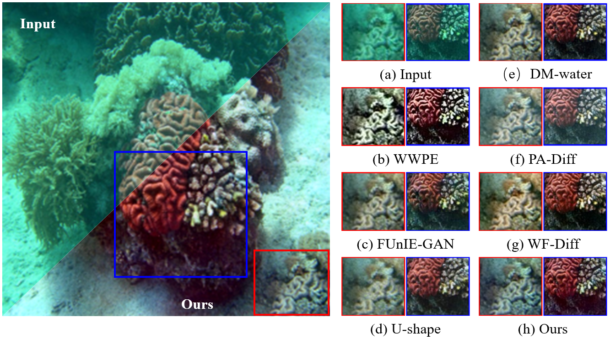
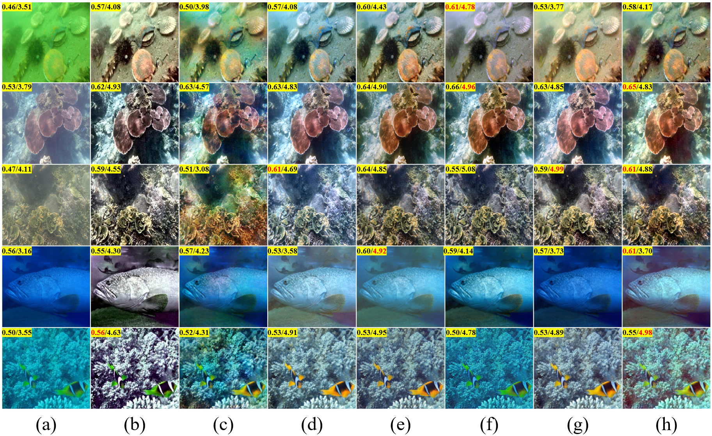

# APD-LDM

<h2>Amplitude-Phase Decomposition-based Latent Diffusion Model for
Underwater Image Enhancement</h2>

​         

## :desktop_computer: Requirements

- Pytorch >= 1.13.1
- CUDA >= 11.3
- Other required packages in `requirements.txt`

## 📦 Models

| Name                       |  Model                       |
|----------------------------|--------------------------------------|
| UIEBD | [Download 🔗]()|
| LSUI | [Download 🔗]()|

## Testing steps:
- Putting your data into the dataset folder. 
- Download the pre-trained model. Then, put the model in the experiments_supervised folder 。
- More details will be released after the article is accepted.

### Thanks
Our code is based on [LightenDiffusion](https://github.com/JianghaiSCU/LightenDiffusion). You can refer to their README files and source code for more implementation details. 

## :love_you_gesture: Citation
If you find our work useful for your research, please consider citing the paper:
